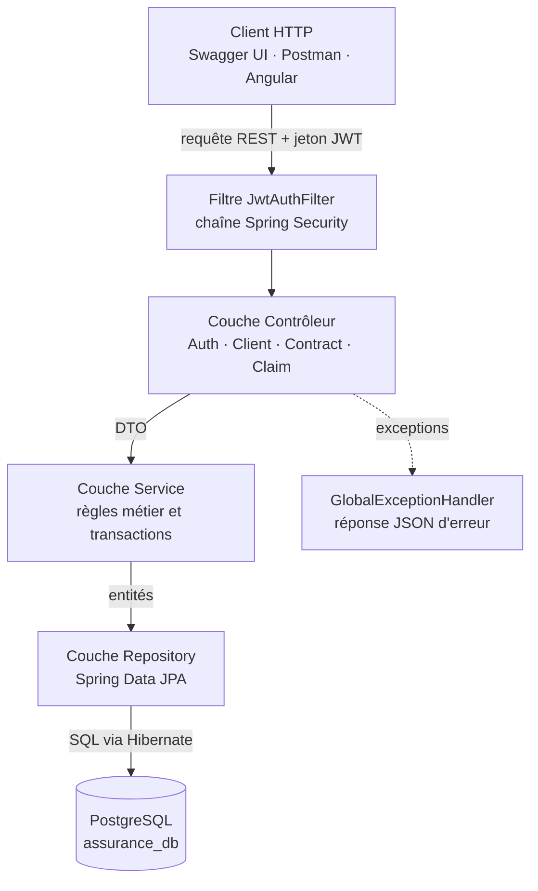
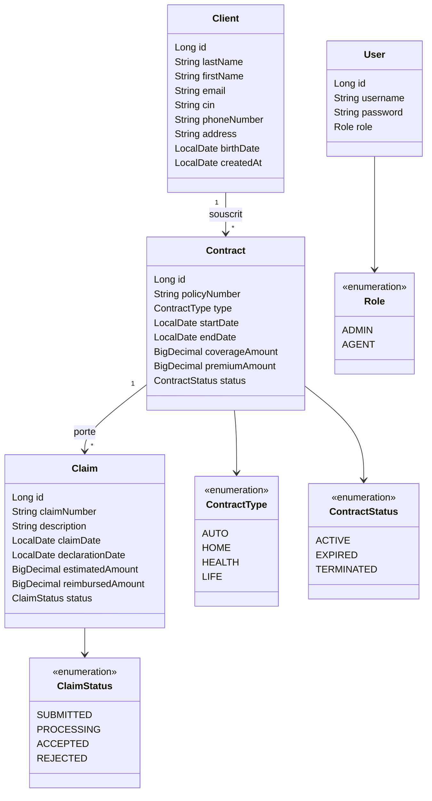
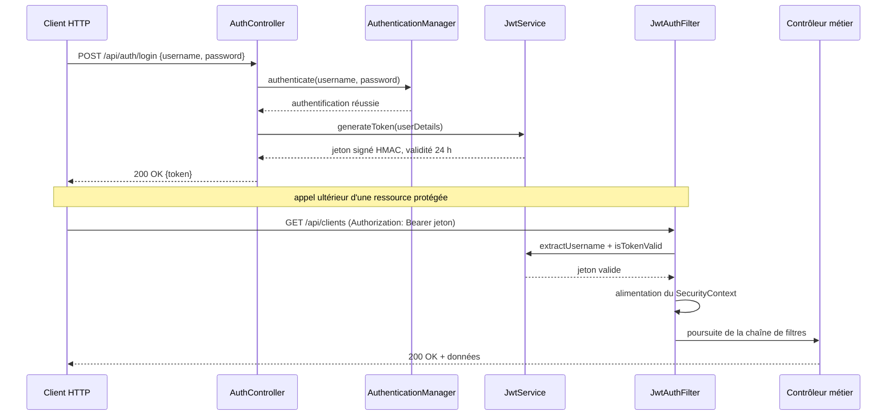
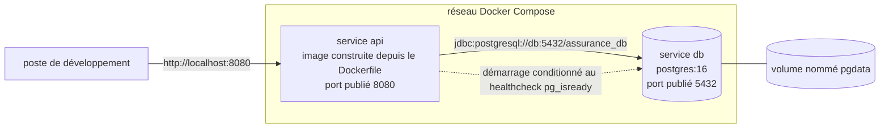
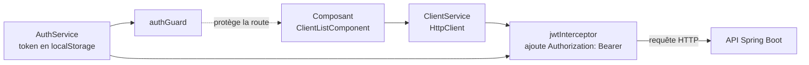

# Rapport de stage — Mini-API Assurance

> **Notes de conversion (à supprimer avant impression)**
>
> Times New Roman 12 pts · interligne 1,5 · texte justifié · emphase en gras ou italique uniquement, jamais souligné · titres en casse normale · marges haut 2,5 cm, bas 2,5 cm, gauche 3 cm, droite 2,5 cm · en-tête et pied à 1,0 cm · en-tête « Mini-API Assurance — Vermeg » + « Taher Yahia » · pied de page : numéro de page · titres numérotés décimalement via les styles Titre 1 à 3 · légende de figure **sous** la figure, légende de tableau **au-dessus** · espaces insécables avant `;` `:` `?` `!` `%`.
> Procédure complète : voir `NOTES_MISE_EN_PAGE_WORD.md`.

---

## Page de garde

<div align="center">

**République Tunisienne**
**Ministère de l'Enseignement Supérieur et de la Recherche Scientifique**
**Université de Gabès**
**Institut Supérieur d'Informatique et de Multimédia de Gabès**

&nbsp;

*[Logos de l'Université de Gabès et de l'ISIMG — reprendre le modèle officiel de page de garde téléchargeable depuis le compte ISIMG]*

&nbsp;

**Rapport de stage d'initiation**

*Licence Fondamentale en Informatique — Génie Logiciel (FIGL), première année*

&nbsp;

# Conception et réalisation d'une mini-API REST de gestion d'assurance

&nbsp;

**Réalisé par :** Taher Yahia

**Organisme d'accueil :** Vermeg

**Encadrante entreprise :** Mme Faten Kardous, *Lead Developer*, Insurance Market Operations

**Encadrant académique :** [À COMPLÉTER]

**Période :** du 1er au 31 juillet 2026

**Lieu :** Vermeg — [entité et adresse exactes À COMPLÉTER]

**Année universitaire :** 2025 / 2026

&nbsp;

*[courriel À COMPLÉTER] — [téléphone À COMPLÉTER]*

</div>

<div style="page-break-after: always;"></div>

---

## Remerciements

Je remercie Mme Faten Kardous, *Lead Developer* au sein du département Insurance Market Operations de Vermeg, pour son encadrement, sa disponibilité et la clarté des objectifs qu'elle m'a fixés.

Je remercie les collaborateurs de Vermeg que j'ai côtoyés pour leur accueil et leurs conseils, ainsi que le corps enseignant de l'ISIMG, dont la formation de première année a constitué la base directe des travaux présentés ici.

Je remercie enfin les membres du jury pour l'attention portée à ce document.

<div style="page-break-after: always;"></div>

---

## Table des matières

*(Dans Word : insérer une table des matières automatique à partir des styles Titre 1 à 3, puis supprimer la liste ci-dessous.)*

Introduction · Chapitre 1 — Présentation de l'entreprise et cadre du stage (1.1 Vermeg · 1.2 Cadre et organisation · 1.3 Sujet et objectifs · 1.4 Méthodologie) · Chapitre 2 — Contexte et analyse du besoin (2.1 Contexte métier · 2.2 Besoins fonctionnels · 2.3 Besoins non fonctionnels · 2.4 Périmètre) · Chapitre 3 — Conception (3.1 Architecture globale · 3.2 Modèle de domaine · 3.3 Couches applicatives · 3.4 Sécurité · 3.5 API REST · 3.6 Environnement conteneurisé) · Chapitre 4 — Réalisation technique (4.1 Stack · 4.2 Backend · 4.3 Persistance · 4.4 Authentification · 4.5 Fonctionnalités et règles métier · 4.6 Documentation OpenAPI · 4.7 Conteneurisation · 4.8 Initiative personnelle : frontend Angular) · Chapitre 5 — Vérification, résultats et regard critique (5.1 Stratégie de vérification · 5.2 Résultats · 5.3 Difficultés · 5.4 Regard critique) · Chapitre 6 — Apports du stage (6.1 Compétences techniques · 6.2 Compétences transversales · 6.3 Lien avec la formation · 6.4 Limites et perspectives) · Conclusion · Bibliographie · Annexes A à D

## Liste des figures

- Figure 1 — Architecture globale de la solution
- Figure 2 — Modèle de domaine de l'application
- Figure 3 — Séquence d'authentification et d'accès à une ressource protégée
- Figure 4 — Composition de l'environnement Docker Compose
- Figure 5 — Chaîne d'appel du frontend Angular vers l'API

## Liste des tableaux

- Tableau 1 — Besoins fonctionnels retenus
- Tableau 2 — Stack technique et justification
- Tableau 3 — Règles métier implémentées
- Tableau 4 — Difficultés rencontrées et solutions apportées
- Tableau 5 — Compétences acquises et modules associés
- Tableau 6 — Limites identifiées et pistes d'amélioration

<div style="page-break-after: always;"></div>

---

## Introduction

Le cursus de licence en informatique de l'Institut Supérieur d'Informatique et de Multimédia de Gabès (ISIMG) prévoit un stage d'initiation d'une durée minimale de quatre semaines continues. Ce stage vise à découvrir l'organisation réelle d'une entreprise du secteur, à mettre en pratique les acquis de première année et à produire un document professionnel rendant compte du travail effectué.

J'ai effectué ce stage du 1er au 31 juillet 2026 chez Vermeg, éditeur de solutions logicielles pour les services financiers et l'assurance, sous l'encadrement de Mme Faten Kardous, *Lead Developer* au département Insurance Market Operations. Les formalités administratives associées — convention, fiche de suivi, attestation — ont été traitées séparément et ne font pas l'objet de ce rapport.

Le sujet confié porte sur la réalisation d'une **mini-API REST de gestion d'assurance** : construire, à partir de zéro, un service web gérant les objets élémentaires d'un système assurantiel — clients, contrats et sinistres — en respectant les pratiques en vigueur dans l'entreprise. La problématique peut se formuler ainsi : *comment exposer, de manière sûre, cohérente et documentée, les opérations de gestion d'un portefeuille d'assurance élémentaire, tout en garantissant le respect des règles qui lient un sinistre à son contrat et un contrat à son client ?*

Six objectifs opérationnels ont été fixés : modéliser le domaine sous forme d'entités persistantes ; exposer une API REST couvrant clients, contrats et sinistres ; faire respecter les règles métier par le serveur plutôt que par le client ; sécuriser les accès par jeton ; documenter l'interface de manière interactive ; rendre l'environnement d'exécution reproductible.

Le rapport suit six chapitres : présentation de l'entreprise et du cadre du stage, analyse du besoin, conception, réalisation technique, vérification et regard critique, puis bilan au regard de la formation.

<div style="page-break-after: always;"></div>

---

## Chapitre 1 — Présentation de l'entreprise et cadre du stage

### 1.1. Présentation de Vermeg

Vermeg est un éditeur de solutions logicielles spécialisé dans les services financiers, dont l'offre couvre la banque, les marchés de capitaux, la gestion d'actifs et l'assurance [1], [2]. Fondée en 1993 en Tunisie sous le nom de BFI, dont elle a été détachée en 2002, l'entreprise a aujourd'hui son siège à Amsterdam et dispose d'implantations sur plusieurs continents, dont la Tunisie [2]. Son activité consiste à fournir aux institutions financières des progiciels métier et des développements sur mesure : gestion de portefeuilles, reporting réglementaire, gestion du collatéral et gestion de polices d'assurance [1], [2].

Le département qui m'a accueilli, **Insurance Market Operations**, intervient sur le segment assurance. Cette spécialisation explique le sujet confié : travailler sur les objets métier fondamentaux de l'assurance permet de se familiariser avec le vocabulaire et la logique du domaine dans lequel l'équipe évolue quotidiennement.

*Les données relatives à l'organigramme, à l'effectif du site et aux résultats financiers n'ont pas été communiquées dans un cadre exploitable : [À COMPLÉTER si l'entreprise fournit des informations officielles].*

### 1.2. Cadre et organisation du stage

Le stage s'est déroulé sur quatre semaines pleines et continues, du 1er au 31 juillet 2026, conformément à la durée minimale exigée par l'ISIMG. L'organisation a reposé sur un rythme itératif : un objectif fonctionnel par période de quelques jours, une réalisation autonome, puis un point de validation avec l'encadrante. Le découpage suivi a été le suivant. **Semaine 1** : prise de connaissance du domaine et de l'écosystème Spring Boot, initialisation du projet, modélisation des entités et persistance. **Semaine 2** : couches service et contrôleur pour les clients et les contrats, objets de transfert et validation. **Semaine 3** : sinistres et règles associées, sécurisation par jeton, documentation OpenAPI, gestion des erreurs. **Semaine 4** : conteneurisation, premier test unitaire, travail personnel sur un client Angular, rédaction du rapport.

### 1.3. Sujet et objectifs

Le sujet consiste à développer une interface de programmation REST autonome, sans dépendance à un système existant de l'entreprise, gérant trois ressources métier reliées : clients, contrats et sinistres. L'accent porte sur le **backend** : le cahier des charges visait un service serveur correct, structuré et sécurisé, et non une interface graphique. Cette orientation est cohérente avec l'objectif pédagogique — consolider la programmation orientée objet, la persistance relationnelle et la conception d'API avant d'aborder les couches de présentation.

### 1.4. Méthodologie de travail

J'ai utilisé Git avec un dépôt distant sur GitHub, en conservant la branche principale dans un état fonctionnel et en isolant les développements exploratoires sur des branches dédiées : le client Angular, mené hors du périmètre initial, a été développé sur une branche séparée afin de ne pas déstabiliser le backend validé. Les messages de commit suivent la convention *Conventional Commits* [3], qui préfixe le message par le type de changement (`feat`, `fix`, `test`, `docs`) ; elle rend l'historique lisible et permet de retrouver rapidement le contexte d'une modification. C'est une pratique professionnelle que je n'appliquais pas avant ce stage.

Outils employés : IntelliJ IDEA pour Java, Visual Studio Code pour Angular, `psql` et pgAdmin pour l'inspection de la base, Swagger UI et Postman pour l'appel des points d'accès, Docker Desktop pour l'exécution conteneurisée.

*Le cadre étant posé, le chapitre suivant précise le besoin et délimite le périmètre.*

<div style="page-break-after: always;"></div>

---

## Chapitre 2 — Contexte et analyse du besoin

### 2.1. Contexte métier

Un système d'assurance manipule, à son niveau élémentaire, trois notions articulées hiérarchiquement. Un **client** est une personne physique identifiée par ses données d'état civil et un identifiant national — en Tunisie, le numéro de carte d'identité nationale (CIN). Un **contrat**, ou police, lie un client à une garantie : il porte un numéro unique, un type de couverture (automobile, habitation, santé, vie), une période de validité, un montant de couverture, une prime et un statut reflétant son cycle de vie — actif, expiré ou résilié. Un **sinistre** est un événement dommageable déclaré au titre d'un contrat : il porte un numéro, une description, une date de survenance, une date de déclaration, un montant estimé, un éventuel remboursement et un statut d'instruction.

La cohérence de cet ensemble repose sur des invariants simples mais impératifs : un sinistre ne peut exister sans contrat, un contrat sans client, et un sinistre ne peut être déclaré que sur un contrat en cours de validité au moment des faits. Le rôle du serveur est de garantir ces invariants indépendamment du client appelant.

### 2.2. Besoins fonctionnels

*Tableau 1 — Besoins fonctionnels retenus*

| Réf. | Besoin | Statut |
|---|---|---|
| BF1 | Créer un compte utilisateur avec un rôle | Réalisé |
| BF2 | S'authentifier et obtenir un jeton d'accès | Réalisé |
| BF3 | Créer, consulter, modifier un client | Réalisé |
| BF4 | Supprimer un client sans contrat rattaché | Réalisé |
| BF5 | Créer un contrat pour un client existant | Réalisé |
| BF6 | Consulter la liste et le détail des contrats | Réalisé |
| BF7 | Mettre à jour un contrat (montants, échéance, statut) | Réalisé |
| BF8 | Déclarer un sinistre sur un contrat | Réalisé |
| BF9 | Consulter les sinistres d'un contrat | Réalisé |
| BF10 | Instruire un sinistre (transitions de statut, remboursement) | Non retenu — reporté |

Le besoin BF10 a été identifié pendant l'analyse mais écarté du périmètre : il suppose un modèle de workflow d'instruction dont la définition dépassait le temps disponible. Il figure dans les perspectives (section 6.4).

### 2.3. Besoins non fonctionnels

**Sécurité** : aucune ressource métier accessible sans authentification, aucun mot de passe stocké en clair. **Intégrité** : les contraintes d'unicité et de non-nullité doivent être portées par le schéma relationnel et non seulement par le code. **Validation** : toute donnée entrante doit être vérifiée avant traitement, avec un retour exploitable. **Documentation** : l'interface doit être auto-documentée et testable sans outil externe. **Portabilité** : l'application doit démarrer sur un poste tiers avec un minimum d'installation. **Absence d'état de session** : le service doit rester sans état, afin de demeurer simple à répliquer.

### 2.4. Périmètre retenu et hors-périmètre

Le périmètre demandé se limite au **backend** : l'API REST, sa persistance, sa sécurité et sa documentation. La conteneurisation y a été ajoutée en cours de stage pour répondre au besoin de portabilité.

Une **interface web Angular** a par ailleurs été développée. Il s'agit d'une **initiative personnelle**, entreprise en fin de stage, dans un objectif de montée en compétences : découvrir un framework front-end et vérifier concrètement que l'API produite était consommable par un client réel, notamment sur les aspects de politique d'origine croisée et de transmission du jeton. Ce travail n'était pas une exigence de l'entreprise, il est partiel, et il est présenté comme tel (section 4.8).

Sont explicitement hors-périmètre : la gestion des primes et échéanciers, le workflow d'instruction des sinistres, l'édition de documents contractuels, l'intégration à un système d'information existant et tout déploiement en production.

*Le besoin étant délimité, le chapitre suivant présente les choix de conception.*

<div style="page-break-after: always;"></div>

---

## Chapitre 3 — Conception

### 3.1. Architecture globale

L'application suit une architecture en couches, où chaque couche ne dialogue qu'avec sa voisine immédiate (figure 1). Une requête émise par un client HTTP traverse d'abord la chaîne de filtres de sécurité, atteint un contrôleur qui délègue le traitement à un service ; le service applique les règles métier et sollicite un *repository*, lequel dialogue avec PostgreSQL par l'intermédiaire de JPA.



*Figure 1 — Architecture globale de la solution*

Cette organisation applique le principe de séparation des responsabilités. Elle a produit deux bénéfices observables : la logique métier reste testable indépendamment du transport HTTP, comme l'a montré l'écriture du test unitaire du service de sinistres (section 5.1) ; et une modification du contrat d'interface n'impacte pas le cœur métier tant que les objets de transfert sont conservés.

### 3.2. Modèle de domaine

Le modèle, représenté en figure 2, comporte quatre entités persistantes et quatre énumérations. Les relations sont de type « un-à-plusieurs » : un client possède plusieurs contrats, un contrat porte plusieurs sinistres. L'entité `User`, dédiée à l'authentification, est indépendante du domaine assurance.



*Figure 2 — Modèle de domaine de l'application*

Trois décisions de modélisation méritent justification. Les **montants** sont typés `BigDecimal` et non `double` : un flottant binaire ne représente pas exactement les valeurs décimales et introduit des erreurs d'arrondi inacceptables sur des montants financiers. Les **énumérations** sont persistées en chaînes de caractères et non par leur position ordinale : le stockage ordinal rend la base illisible et surtout fragile, puisque l'insertion d'une valeur au milieu de l'énumération corromprait silencieusement les données existantes. Les **associations** sont chargées paresseusement afin d'éviter le chargement du graphe complet d'objets à chaque lecture ; ce choix impose en contrepartie que la conversion en objets de transfert ait lieu dans la transaction, contrainte à l'origine d'une difficulté détaillée en section 5.3.

### 3.3. Architecture applicative en couches

Le code est organisé en paquetages fonctionnels sous `com.assurance.mini_api_assurance` : `domain` (entités et énumérations), `dto` (objets de transfert), `mapper` (conversion entité ↔ DTO), `repository` (interfaces Spring Data), `service` (règles métier et transactions), `controller` (exposition HTTP), `security` (jetons et chargement des utilisateurs), `config` (sécurité, OpenAPI, données de démonstration) et `exception` (exceptions métier et gestionnaire global).

L'introduction de **DTO distincts des entités** est un choix structurant : il évite d'exposer le modèle persistant — ce qui divulguerait des champs internes tels que le mot de passe haché — et permet des contrats d'entrée différenciés. `ClientCreateDto` exige ainsi le CIN, alors que `ClientUpdateDto` ne le contient pas, ce qui interdit techniquement la modification d'un identifiant national après création.

### 3.4. Conception de la sécurité

L'authentification repose sur le standard JSON Web Token défini par la RFC 7519 [4]. L'utilisateur s'authentifie une fois par identifiant et mot de passe, reçoit un jeton signé, puis le présente à chaque requête ultérieure dans l'en-tête `Authorization`. Le serveur ne conserve aucune session : il vérifie la signature et l'expiration à chaque appel. La figure 3 détaille les deux temps de cet échange.



*Figure 3 — Séquence d'authentification et d'accès à une ressource protégée*

Trois principes ont guidé cette conception. Les mots de passe sont **hachés avec BCrypt** avant persistance, algorithme intégrant un sel et un coût de calcul paramétrable. La politique de session est fixée à **`STATELESS`**, cohérente avec un service consommé par des clients hétérogènes. La protection **CSRF est désactivée** : cette attaque exploite l'envoi automatique des cookies par le navigateur, mécanisme non utilisé ici puisque le jeton est transmis explicitement dans un en-tête. Ce choix est justifié dans le contexte d'une API sans cookie, mais devrait être réévalué si une authentification par cookie était introduite.

### 3.5. Conception de l'API REST

Les points d'accès suivent les conventions REST : ressources désignées par des noms au pluriel, verbes HTTP porteurs de la sémantique de l'opération, codes de statut normalisés par la RFC 9110 [5] — 200 pour une lecture, 201 pour une création, 204 pour une suppression sans corps. La liste complète figure en annexe A.

Les sinistres sont exposés comme une **sous-ressource du contrat** (`/api/contracts/{contractId}/claims`) et non comme une ressource racine : ce choix traduit dans l'URL la dépendance d'existence, l'identifiant du contrat devenant un paramètre obligatoire du chemin plutôt qu'un champ facultatif du corps de la requête. Enfin, la génération des identifiants métier — numéros de police et de sinistre — est **assumée par le serveur**, de même que la date de création d'un client, la date de déclaration d'un sinistre et le statut initial d'un contrat, ce qui évite qu'un client défectueux n'impose des valeurs incohérentes.

### 3.6. Environnement d'exécution conteneurisé

Pour répondre au besoin de portabilité, l'application et sa base sont décrites sous forme de deux services conteneurisés orchestrés par Docker Compose (figure 4).



*Figure 4 — Composition de l'environnement Docker Compose*

Deux mécanismes garantissent un démarrage fiable. Un **contrôle de santé** (`pg_isready`) est défini sur le service de base de données, et le service applicatif déclare une dépendance conditionnée à ce contrôle : l'API n'est lancée qu'une fois PostgreSQL réellement prêt à accepter des connexions, et non simplement démarré. Un **volume nommé** assure la persistance des données entre deux arrêts de la pile.

*La conception étant établie, le chapitre suivant décrit sa traduction en code.*

<div style="page-break-after: always;"></div>

---

## Chapitre 4 — Réalisation technique

### 4.1. Stack technique et justification des choix

Le tableau 2 récapitule les composants retenus et la raison de chaque choix.

*Tableau 2 — Stack technique et justification*

| Composant | Version | Justification du choix |
|---|---|---|
| Java | 17 | Version à support long ; introduit les *records*, utilisés pour les DTO |
| Spring Boot | 3.5.16 | Auto-configuration, serveur embarqué ; socle utilisé par l'équipe d'accueil [9] |
| Spring Data JPA / Hibernate | héritées | Réduisent l'accès aux données à des déclarations d'interfaces [11] |
| PostgreSQL | 16 | Base relationnelle robuste et gratuite, adaptée aux contraintes d'intégrité [14] |
| Spring Security | héritée | Chaîne de filtres et infrastructure d'authentification [10] |
| JJWT | 0.12.6 | Bibliothèque de référence pour la manipulation de JWT en Java |
| Bean Validation | héritée | Validation déclarative par annotations sur les DTO |
| springdoc-openapi | 2.7.0 | Génère la spécification OpenAPI [12] et l'interface Swagger UI |
| Maven (wrapper) | — | Le wrapper garantit une version de build identique pour tous |
| Docker / Compose | — | Reproductibilité de l'environnement de développement [6] |
| Angular | 21.2 | Client web — initiative personnelle hors périmètre [13] |

Le choix de Spring Boot n'était pas discutable : il s'agit du socle utilisé par l'équipe d'accueil, et l'un des objectifs du stage était de me familiariser avec cet écosystème. L'ampleur du framework a néanmoins constitué une réelle difficulté d'apprentissage (section 5.3).

### 4.2. Mise en place du backend Spring Boot

Le projet a été initialisé avec Spring Initializr, puis structuré selon les paquetages décrits en section 3.3. L'injection de dépendances est réalisée **par constructeur** dans l'ensemble des classes, sans annotation sur les champs : ce style rend les dépendances explicites, autorise la déclaration des champs en `final` et permet d'instancier une classe hors du conteneur Spring — condition nécessaire à l'écriture de tests unitaires avec des doublures. Les DTO sont implémentés sous forme de *records* Java, immuables et dépourvus de code répétitif :

```java
public record ClientCreateDto(
        @NotBlank String lastName,
        @NotBlank String firstName,
        @Email @NotBlank String email,
        @NotBlank String cin,
        @NotBlank String phoneNumber,
        @NotBlank String address,
        @NotNull LocalDate birthDate
) {}
```

*Extrait 1 — DTO de création d'un client. Les annotations de Bean Validation sont évaluées lorsque le paramètre du contrôleur est annoté `@Valid` ; une entrée invalide est rejetée avant d'atteindre la couche service.*

### 4.3. Persistance PostgreSQL et JPA

Les quatre entités sont annotées `@Entity` et dotées d'un identifiant technique généré par la base. L'entité `User` est explicitement mappée sur la table `app_user`, `user` étant un mot réservé en SQL [14]. Les contraintes d'intégrité sont déclarées au niveau du mapping et donc répercutées dans le schéma : unicité du CIN, du numéro de police, du numéro de sinistre et du nom d'utilisateur ; non-nullité des champs obligatoires ; clés étrangères non nulles. Porter ces règles dans le schéma plutôt que dans le seul code garantit qu'elles restent valides même si une écriture contourne l'application.

Les *repositories* étendent `JpaRepository`, ce qui fournit les opérations élémentaires sans code [11]. Trois méthodes seulement ont été déclarées, par dérivation à partir du nom : `findByUsername`, `findByContractId` et `existsByClientId` — cette dernière servant à interdire la suppression d'un client encore lié à un contrat, sans charger les contrats en mémoire.

Enfin, `open-in-view` est fixé à `false`. Cette propriété, activée par défaut, maintient la session Hibernate ouverte pendant le rendu de la réponse et masque ainsi les chargements paresseux involontaires ; la désactiver oblige à traiter explicitement les accès aux associations dans la couche service, ce qui évite des requêtes SQL non maîtrisées.

### 4.4. Authentification et autorisation

`JwtService` centralise la manipulation des jetons : génération avec le nom d'utilisateur comme sujet, date d'émission, expiration à vingt-quatre heures et signature HMAC ; puis extraction du sujet et vérification de validité. La clé est décodée depuis une chaîne Base64 lue dans la configuration.

`JwtAuthFilter` étend `OncePerRequestFilter` et s'intercale avant le filtre d'authentification par formulaire [10] :

```java
final String authHeader = request.getHeader("Authorization");
if (authHeader == null || !authHeader.startsWith("Bearer ")) {
    filterChain.doFilter(request, response);   // requête anonyme : la chaîne décidera
    return;
}
final String jwt = authHeader.substring(7);
final String username = jwtService.extractUsername(jwt);

if (username != null && SecurityContextHolder.getContext().getAuthentication() == null) {
    UserDetails userDetails = this.userDetailsService.loadUserByUsername(username);
    if (jwtService.isTokenValid(jwt, userDetails)) {
        UsernamePasswordAuthenticationToken authToken =
                new UsernamePasswordAuthenticationToken(userDetails, null, userDetails.getAuthorities());
        SecurityContextHolder.getContext().setAuthentication(authToken);
    }
}
filterChain.doFilter(request, response);
```

*Extrait 2 — Cœur du filtre d'authentification par jeton. Le filtre ne rejette jamais une requête lui-même : il se contente de renseigner le contexte de sécurité, et c'est la chaîne configurée dans `SecurityConfig` qui décide ensuite d'autoriser ou de refuser l'accès. Cette séparation permet aux routes publiques de fonctionner sans traitement particulier.*

Concernant l'**autorisation par rôle**, il convient d'être précis. Les rôles `ADMIN` et `AGENT` sont définis, portés par l'entité `User` et convertis en autorités Spring par `CustomUserDetails`. Des annotations `@PreAuthorize` ont été posées sur trois méthodes de contrôleur. Cependant, l'annotation d'activation `@EnableMethodSecurity` n'a pas été ajoutée à la configuration : ces annotations sont donc **présentes mais non appliquées** à l'exécution. Le niveau de protection effectivement en place est l'authentification — toute route hors `/api/auth/**` et hors documentation exige un jeton valide — et non une différenciation par rôle. Ce point est repris en section 5.4.

### 4.5. Fonctionnalités implémentées et règles métier

Treize points d'accès sont exposés, couvrant l'authentification, la gestion complète des clients, celle des contrats et la déclaration ou la consultation des sinistres (annexe A). La valeur de l'application ne réside toutefois pas dans ces opérations d'accès aux données, mais dans les règles que le serveur fait respecter (tableau 3).

*Tableau 3 — Règles métier implémentées*

| Réf. | Règle | Emplacement | Réaction |
|---|---|---|---|
| RM1 | La date de fin d'un contrat ne peut précéder sa date de début | `ContractService` | Exception métier |
| RM2 | Un contrat créé est nécessairement au statut `ACTIVE` | `ContractService` | Valeur imposée |
| RM3 | Le numéro de police est généré par le serveur | `ContractService` | Valeur imposée |
| RM4 | Un statut de contrat invalide est rejeté à la mise à jour | `ContractService` | Exception métier |
| RM5 | Aucun sinistre ne peut être déclaré sur un contrat non `ACTIVE` | `ClaimService` | Exception métier |
| RM6 | La date de survenance doit tomber dans la période de couverture | `ClaimService` | Exception métier |
| RM7 | Un sinistre créé est `SUBMITTED`, remboursement initialisé à zéro | `ClaimService` | Valeurs imposées |
| RM8 | La date de création d'un client est fixée par le serveur | `ClientService` | Valeur imposée |
| RM9 | Un client rattaché à un contrat ne peut être supprimé | `ClientService` | Exception métier |
| RM10 | Un nom d'utilisateur ne peut être utilisé deux fois | `UserService` | Exception |

La règle RM5 illustre la logique du domaine : accepter une déclaration de sinistre sur un contrat résilié ou expiré créerait une donnée dépourvue de sens juridique. Le contrôle est placé dans la couche service, ce qui garantit son application quel que soit le point d'entrée.

```java
@Transactional
public ClaimResponseDto createClaim(Long contractId, ClaimCreateDto dto) {
    Contract contract = contractRepository.findById(contractId)
            .orElseThrow(() -> new NotFoundException("Contract not found with ID: " + contractId));

    if (contract.getStatus() != ContractStatus.ACTIVE) {
        throw new BusinessRuleException("Cannot file a claim: Contract is not ACTIVE");
    }
    if (dto.claimDate().isBefore(contract.getStartDate())
            || dto.claimDate().isAfter(contract.getEndDate())) {
        throw new BusinessRuleException("Claim date must be within the contract coverage period");
    }
    // construction du sinistre : statut SUBMITTED, numéro généré, persistance
}
```

*Extrait 3 — Application des règles RM5 et RM6. La méthode est transactionnelle : en cas d'exception, aucune écriture partielle n'est validée.*

Un composant `DataInitializer` alimente la base au démarrage si elle est vide : deux comptes utilisateurs, un client et deux contrats — l'un actif, l'autre résilié, ce dernier permettant de vérifier immédiatement la règle RM5. Il s'agit exclusivement de **données de démonstration destinées au développement local** ; elles n'ont pas vocation à exister dans un environnement réel et devraient être conditionnées à un profil Spring dédié.

### 4.6. Documentation OpenAPI

La dépendance `springdoc-openapi` génère automatiquement la spécification OpenAPI [12] à partir des signatures des contrôleurs et l'expose via une interface Swagger UI. Une classe de configuration complète cette génération en déclarant le titre, la version et surtout un schéma de sécurité `bearerAuth` appliqué à l'ensemble des routes. L'intérêt pratique est immédiat : le bouton « Authorize » permet de coller le jeton obtenu au *login* puis de tester toutes les routes protégées depuis le navigateur, sans outil externe. Pendant le développement, cette documentation a servi d'outil de test principal.

### 4.7. Conteneurisation avec Docker Compose

Le `Dockerfile` est construit en **deux étapes**. La première utilise une image contenant Maven et le JDK 17 pour compiler le projet et produire une archive exécutable ; la seconde repart d'une image ne contenant qu'un environnement d'exécution Java et n'y copie que l'archive produite. Cette construction en plusieurs étapes est la pratique recommandée par la documentation Docker [6] : l'image finale ne contient ni code source, ni Maven, ni cache de dépendances, ce qui réduit sa taille et sa surface d'exposition.

La configuration de l'API est injectée par variables d'environnement, que le fichier `application.yaml` consomme via des valeurs par défaut surchargeables. La même image fonctionne donc en local et en conteneur sans modification de code — application directe du principe de configuration externalisée [7]. Le résultat est un **environnement de développement reproductible** : deux commandes suffisent à démarrer l'API et sa base sur un poste vierge. Il ne s'agit pas d'un dispositif de production ; les limites sont détaillées en section 5.4.

### 4.8. Initiative personnelle : frontend Angular

Cette section décrit un travail **non demandé par l'entreprise**, mené en fin de stage à titre d'apprentissage : découvrir Angular [13] et valider en conditions réelles que l'API était consommable par un client navigateur — ce qui met à l'épreuve la configuration CORS et la transmission du jeton.



*Figure 5 — Chaîne d'appel du frontend Angular vers l'API*

Trois pièces constituent le mécanisme d'authentification côté client (figure 5). Un **service d'authentification** appelle la route de connexion et conserve le jeton dans le `localStorage`. Un **intercepteur HTTP** ajoute automatiquement l'en-tête `Authorization` à chaque requête sortante, évitant de répéter cette logique dans chaque service. Une **garde de route** empêche l'accès aux pages protégées en l'absence de jeton. Quatre écrans ont été réalisés : connexion, tableau de bord, liste des clients et formulaire de création. Côté backend, ce travail a nécessité l'ajout d'une configuration CORS autorisant l'origine du serveur de développement Angular.

L'état d'avancement doit être présenté sans exagération. Les écrans relatifs aux **contrats et aux sinistres n'existent pas** ; la modification et la suppression d'un client ne sont pas accessibles depuis l'interface ; l'URL de l'API est codée en dur ; l'intercepteur ne traite pas les réponses 401, si bien qu'un jeton expiré n'entraîne pas de redirection ; le stockage du jeton dans le `localStorage` reste vulnérable aux injections de script. Ce frontend est donc une **maquette d'apprentissage**, utile comme preuve de consommation de l'API, et non un produit livrable.

*Le chapitre suivant expose la manière dont ces développements ont été vérifiés et les limites du travail réalisé.*

<div style="page-break-after: always;"></div>

---

## Chapitre 5 — Vérification, résultats et regard critique

### 5.1. Stratégie de vérification

La vérification a reposé sur trois moyens d'importance inégale.

Les **tests automatisés** sont au nombre de deux. Le premier vérifie que le contexte Spring démarre correctement : il détecte les erreurs de configuration, mais requiert une base PostgreSQL accessible, ce qui le rend dépendant de l'environnement. Le second est un test unitaire écrit avec JUnit 5 et Mockito : il simule un contrat au statut `TERMINATED` et vérifie que la déclaration d'un sinistre lève bien une exception métier. Il valide la règle RM5, la plus caractéristique du domaine, et n'a été rendu possible que par l'injection par constructeur, qui permet d'instancier le service avec des *repositories* simulés.

Les **tests manuels via Swagger UI** ont constitué l'outil de vérification principal au quotidien : après chaque nouvelle fonctionnalité, le parcours complet — authentification, création d'un client, création d'un contrat, déclaration d'un sinistre — était rejoué depuis le navigateur. Les **vérifications en base** avec `psql` ont permis de contrôler que le schéma généré portait bien les contraintes attendues.

La limite doit être énoncée clairement : **la couverture de test automatisée est très faible**. Un seul test unitaire couvre une seule règle métier sur les dix implémentées ; aucun test de contrôleur, de sécurité ou de frontend n'a été écrit, et aucun taux de couverture n'est mesuré.

### 5.2. Résultats obtenus

L'API est fonctionnelle sur l'ensemble des besoins retenus au tableau 1, à l'exception du besoin BF10 explicitement reporté. Les vérifications confirment les comportements suivants : une requête sans jeton sur une route métier est rejetée ; un *login* valide renvoie un jeton exploitable pendant vingt-quatre heures ; une déclaration de sinistre sur le contrat résilié du jeu de démonstration est refusée avec un message explicite, de même qu'une déclaration hors période de couverture ; la suppression d'un client porteur de contrats est refusée ; un client créé reçoit une date de création serveur et un contrat un numéro de police généré ; un courriel malformé ou un champ obligatoire vide est rejeté avant d'atteindre la couche service ; la pile Docker Compose démarre la base puis l'API dans cet ordre ; le client Angular parvient à s'authentifier, à afficher la liste des clients et à en créer un nouveau.

### 5.3. Difficultés rencontrées et solutions

Sept difficultés significatives ont jalonné le développement. Le tableau 4 en donne l'analyse et la solution retenue.

*Tableau 4 — Difficultés rencontrées et solutions apportées*

| Difficulté | Analyse | Solution retenue |
|---|---|---|
| Échec au démarrage sur la table `user` | `user` est un mot réservé de SQL | Mappage explicite sur la table `app_user` |
| `LazyInitializationException` à la sérialisation | Associations `LAZY` accédées hors transaction, `open-in-view` désactivé | Conversion en DTO dans les méthodes `@Transactional` |
| Requêtes du navigateur bloquées | Politique de même origine entre le port 4200 et le port 8080 | Déclaration d'une source de configuration CORS et activation dans la chaîne |
| Ordre de démarrage des conteneurs | L'API démarrait avant que PostgreSQL n'accepte les connexions | `healthcheck` `pg_isready` + dépendance `service_healthy` |
| Configuration figée entre local et conteneur | L'URL de la base différait selon le contexte | Externalisation par variables d'environnement avec valeurs par défaut |
| Entités exposées directement | Les premières versions divulguaient des champs internes | Introduction de DTO dédiés et de classes de conversion |
| Courbe d'apprentissage de Spring Security | Le fonctionnement de la chaîne de filtres n'était pas intuitif | Lecture de la documentation de référence [10], puis reconstruction pas à pas du filtre |

La difficulté relative au chargement paresseux a été la plus formatrice. Elle m'a obligé à comprendre que le cycle de vie d'un objet JPA est lié à celui de la transaction, notion que je n'avais abordée que théoriquement en cours. La désactivation d'`open-in-view` n'a pas causé le problème : elle l'a rendu visible au lieu de le masquer derrière des requêtes SQL émises silencieusement.

### 5.4. Regard critique et limites

Le socle produit me paraît correct sur le plan structurel : responsabilités séparées, règles métier centralisées côté serveur, contraintes d'intégrité portées par le schéma, interface documentée. Plusieurs faiblesses doivent néanmoins être reconnues.

**L'autorisation par rôle n'est pas effective.** C'est le défaut le plus important. Les annotations `@PreAuthorize` sont présentes mais inopérantes faute d'activation de la sécurité au niveau des méthodes : tout utilisateur authentifié, y compris un compte `AGENT`, peut supprimer un client ou modifier un contrat. Une annotation qui donne l'illusion d'une protection est plus dangereuse qu'une absence de protection assumée, car elle trompe le lecteur du code. La correction est brève : activer la sécurité au niveau des méthodes, puis écrire les tests vérifiant effectivement les refus.

**La gestion des erreurs est trop grossière.** Le gestionnaire global intercepte toute exception d'exécution et renvoie systématiquement un statut 400. Une ressource inexistante devrait produire un 404, une violation de règle métier un 409 ou un 422, un accès refusé un 403 ; en l'état, le client ne peut pas distinguer ces situations. Il faudrait des gestionnaires par type d'exception et un format d'erreur normalisé [8].

**Le secret de signature des jetons est en clair dans le dépôt.** La propriété correspondante est écrite en dur dans `application.yaml`, contrairement aux paramètres de base de données qui sont, eux, externalisés. Il s'agit d'un secret de développement, mais l'habitude prise est mauvaise : une injection par variable d'environnement s'impose.

**Le schéma est géré automatiquement par Hibernate.** Le mode `ddl-auto: update` est pratique en développement mais inadapté dès qu'il existe des données à préserver : il n'exécute aucune suppression ni renommage, ne trace pas les évolutions et ne permet pas de revenir en arrière.

**Le jeton est peu défensif.** Il ne porte pas le rôle en revendication, sa validité de vingt-quatre heures est longue, il n'existe ni rafraîchissement ni révocation, et le filtre ne capture pas les exceptions d'analyse : un jeton expiré ou malformé provoque une remontée d'exception plutôt qu'une réponse 401 propre.

**La conteneurisation reste orientée développement.** L'image s'exécute avec l'utilisateur `root`, les identifiants figurent en clair dans le fichier de composition, aucune limite de ressources n'est fixée, les dépendances Maven ne sont pas mises en cache et les tests sont ignorés lors de la construction. L'objectif visé — la reproductibilité en développement — est atteint ; l'objectif « production » ne l'est pas et n'était pas visé.

Trois faiblesses complètent ce constat. **Aucune intégration continue n'est en place** : rien ne garantit automatiquement que le projet compile et que les tests passent avant une fusion. **L'API manque de robustesse à l'échelle** : les listes sont renvoyées intégralement, sans pagination ni filtre. **La documentation du dépôt est en retard sur le code** : le `README.md` annonce une gestion des clients limitée à la création et à la lecture alors que la modification et la suppression existent, et ne mentionne ni Docker ni le frontend.

*Ces constats, y compris les plus défavorables, constituent l'essentiel de ce que ce stage m'a appris ; le chapitre suivant en tire le bilan.*

<div style="page-break-after: always;"></div>

---

## Chapitre 6 — Apports du stage et lien avec la formation

### 6.1. Compétences techniques acquises

*Tableau 5 — Compétences acquises et modules associés*

| Compétence | Niveau atteint | Module ISIMG associé |
|---|---|---|
| Programmation orientée objet en Java 17 | Consolidé | Programmation orientée objet |
| Conception relationnelle et contraintes d'intégrité | Consolidé | Bases de données |
| Mappage objet-relationnel avec JPA et Hibernate | Nouveau | Bases de données (prolongement) |
| Développement d'une API REST avec Spring Boot | Nouveau | Programmation web (prolongement) |
| Architecture en couches et séparation des responsabilités | Nouveau | Génie logiciel |
| Authentification par jeton et hachage de mots de passe | Nouveau | Sécurité informatique (notions) |
| Test unitaire avec JUnit 5 et Mockito | Initié | Génie logiciel |
| Conteneurisation avec Docker et Docker Compose | Nouveau | Systèmes d'exploitation (prolongement) |
| Gestion de versions avec Git et branches | Consolidé | Outils de développement |
| Développement d'un client Angular | Initié — hors périmètre | Programmation web |

Au-delà de la liste, trois acquis me paraissent structurants. D'abord, la compréhension du **rôle du serveur comme garant des règles métier** : avant ce stage, j'aurais volontiers laissé le client vérifier qu'une date de sinistre tombe dans la période de couverture. Ensuite, la notion de **contrat d'interface** : distinguer ce qu'une API accepte, ce qu'elle renvoie et ce qu'elle stocke est une discipline que je n'appliquais pas. Enfin, la **reproductibilité de l'environnement** : constater qu'un projet démarre sur une machine vierge en deux commandes change la perception de ce qu'est un livrable.

### 6.2. Compétences transversales et lien avec la formation

L'**autonomie** a été la première exigence : sur un sujet largement nouveau, j'ai dû identifier moi-même les ressources pertinentes et distinguer une documentation officielle d'un tutoriel obsolète — plusieurs exemples de code JWT trouvés en ligne s'appuyaient sur des interfaces dépréciées. La **méthode de résolution de problèmes** a progressé : l'erreur de chargement paresseux m'a appris à remonter à la cause première plutôt qu'à modifier le code au hasard jusqu'à la disparition du symptôme. La **rigueur documentaire** s'est développée par la pratique des messages de commit conventionnels et par la rédaction de ce rapport, qui m'a contraint à justifier chaque choix technique — exercice ayant révélé certaines des faiblesses exposées en section 5.4. La **communication professionnelle** s'est exercée lors des points de validation : présenter un avancement de façon synthétique, admettre ce qui ne fonctionne pas et poser une question précise sont des compétences que le cadre académique sollicite peu.

Le stage a prolongé plusieurs enseignements de première année. La **programmation orientée objet** a trouvé une application directe dans la modélisation des entités, l'encapsulation et l'usage des énumérations. Les **bases de données** se sont traduites par la conception du schéma, les contraintes d'unicité et de clé étrangère et la notion de transaction — cette dernière prenant, dans le contexte JPA, une dimension bien plus concrète qu'en cours. L'**algorithmique** a servi dans la structuration des traitements de service. Réciproquement, le stage a mis en évidence des domaines que la formation aborde plus tard : architectures applicatives, sécurité des applications web, tests automatisés et déploiement. Cette découverte anticipée me permettra d'aborder ces modules avec un référentiel concret.

### 6.3. Limites personnelles et perspectives

Je reconnais trois limites personnelles. La **culture du test** m'a manqué : j'ai écrit le code puis, tardivement, un unique test, au lieu de tester au fil des règles métier. La **gestion du temps** a été imparfaite : le temps consacré au frontend, bien qu'instructif, aurait été mieux investi dans la correction de l'autorisation par rôle et de la gestion des erreurs, deux défauts du périmètre effectivement demandé. Enfin, ma **maîtrise de Spring Security** reste superficielle : je sais faire fonctionner la chaîne, je ne saurais pas encore la modifier finement.

*Tableau 6 — Limites identifiées et pistes d'amélioration*

| Limite | Amélioration proposée | Effort |
|---|---|---|
| Autorisation par rôle inopérante | Activer la sécurité au niveau des méthodes et écrire les tests associés | Faible |
| Erreurs toujours renvoyées en 400 | Gestionnaires par type d'exception, format RFC 9457 [8] | Faible |
| Secret de signature en dur | Injection par variable d'environnement | Faible |
| Documentation du dépôt désalignée | Mise à jour du `README` (Docker, frontend, opérations réelles) | Faible |
| Couverture de test insuffisante | Tests de contrôleur et tests d'intégration sur base jetable | Moyen |
| Absence d'intégration continue | Chaîne automatisée : compilation et tests à chaque poussée | Moyen |
| Schéma non versionné | Migrations versionnées avec un outil dédié | Moyen |
| Frontend partiel, workflow des sinistres absent | Écrans contrats et sinistres ; modélisation des transitions de statut | Élevé |

<div style="page-break-after: always;"></div>

---

## Conclusion

Ce stage d'initiation d'un mois chez Vermeg avait pour objet la réalisation d'une mini-API REST de gestion d'assurance. L'objectif est atteint sur le périmètre demandé : le service expose la gestion des clients, des contrats et des sinistres, s'appuie sur une base PostgreSQL, protège ses accès par un jeton JWT, valide ses entrées, centralise ses règles métier dans la couche service et publie une documentation OpenAPI interactive. La conteneurisation ajoutée en fin de parcours rend l'environnement de développement reproductible sur un poste tiers.

Sur le plan technique, j'ai découvert et pratiqué un écosystème que je ne connaissais pas — Spring Boot, JPA, Spring Security, Docker — et j'ai surtout compris pourquoi une architecture en couches, des objets de transfert dédiés et des règles métier centralisées côté serveur ne sont pas des raffinements théoriques mais des réponses à des problèmes concrets.

Sur le plan critique, le travail comporte des faiblesses que j'ai identifiées et documentées : une autorisation par rôle annotée mais non activée, une gestion des erreurs trop uniforme, une couverture de test très faible, un secret non externalisé et une conteneurisation qui ne vise pas la production. Ces constats ont plus de valeur pédagogique que la liste des fonctionnalités livrées, car ils dessinent précisément ce que j'ai à travailler. L'interface Angular développée en parallèle relève, quant à elle, d'une démarche personnelle de montée en compétences : partielle et non demandée, elle a néanmoins prouvé que l'API est consommable par un client réel.

Enfin, ce stage m'a donné un premier aperçu du fonctionnement d'une entreprise d'édition logicielle spécialisée, où la correction fonctionnelle, la traçabilité et la lisibilité du code comptent autant que le résultat visible. C'est cette exigence que je souhaite conserver pour la suite de mon cursus.

<div style="page-break-after: always;"></div>

---

## Bibliographie et webographie

[1] VERMEG, « À propos — éditeur de solutions logicielles pour les services financiers ». [En ligne]. Disponible : https://www.vermeg.com — consulté le 27 juillet 2026.

[2] Wikipedia, « Vermeg ». [En ligne]. Disponible : https://en.wikipedia.org/wiki/Vermeg — consulté le 27 juillet 2026.

[3] Conventional Commits, « Conventional Commits 1.0.0 ». [En ligne]. Disponible : https://www.conventionalcommits.org/fr/v1.0.0/ — consulté le 27 juillet 2026.

[4] M. JONES, J. BRADLEY et N. SAKIMURA, « RFC 7519 : JSON Web Token (JWT) », IETF, mai 2015. [En ligne]. Disponible : https://www.rfc-editor.org/rfc/rfc7519

[5] R. FIELDING, M. NOTTINGHAM et J. RESCHKE, « RFC 9110 : HTTP Semantics », IETF, juin 2022. [En ligne]. Disponible : https://www.rfc-editor.org/rfc/rfc9110

[6] Docker Inc., « Multi-stage builds », Docker Documentation. [En ligne]. Disponible : https://docs.docker.com/build/building/multi-stage/ — consulté le 27 juillet 2026.

[7] A. WIGGINS, « The Twelve-Factor App — III. Config ». [En ligne]. Disponible : https://12factor.net/fr/config — consulté le 27 juillet 2026.

[8] M. NOTTINGHAM, E. WILDE et S. DALAL, « RFC 9457 : Problem Details for HTTP APIs », IETF, juillet 2023. [En ligne]. Disponible : https://www.rfc-editor.org/rfc/rfc9457

[9] VMware Tanzu, « Spring Boot Reference Documentation », version 3.5. [En ligne]. Disponible : https://docs.spring.io/spring-boot/documentation.html — consulté le 27 juillet 2026.

[10] VMware Tanzu, « Spring Security Reference — Architecture ». [En ligne]. Disponible : https://docs.spring.io/spring-security/reference/servlet/architecture.html — consulté le 27 juillet 2026.

[11] VMware Tanzu, « Spring Data JPA Reference Documentation ». [En ligne]. Disponible : https://docs.spring.io/spring-data/jpa/reference/ — consulté le 27 juillet 2026.

[12] OpenAPI Initiative, « OpenAPI Specification v3.1 ». [En ligne]. Disponible : https://spec.openapis.org/oas/v3.1.0 — consulté le 27 juillet 2026.

[13] Google, « Angular Documentation ». [En ligne]. Disponible : https://angular.dev — consulté le 27 juillet 2026.

[14] The PostgreSQL Global Development Group, « PostgreSQL 16 Documentation ». [En ligne]. Disponible : https://www.postgresql.org/docs/16/ — consulté le 27 juillet 2026.

*Les quatorze références sont citées dans le corps du rapport ; réciproquement, aucune citation du texte ne renvoie à une référence absente de cette liste.*

<div style="page-break-after: always;"></div>

---

## Annexe A — Principaux points d'accès de l'API

| Méthode | Chemin | Corps de requête | Réponse | Statut |
|---|---|---|---|---|
| POST | `/api/auth/register` | `{username, password, role}` | message | 201 |
| POST | `/api/auth/login` | `{username, password}` | `{token}` | 200 |
| POST | `/api/clients` | `ClientCreateDto` | `ClientResponseDto` | 201 |
| GET | `/api/clients` | — | liste de clients | 200 |
| GET | `/api/clients/{id}` | — | `ClientResponseDto` | 200 |
| PUT | `/api/clients/{id}` | `ClientUpdateDto` | `ClientResponseDto` | 200 |
| DELETE | `/api/clients/{id}` | — | — | 204 |
| POST | `/api/contracts` | `ContractCreateDto` | `ContractResponseDto` | 201 |
| GET | `/api/contracts` | — | liste de contrats | 200 |
| GET | `/api/contracts/{id}` | — | `ContractResponseDto` | 200 |
| PUT | `/api/contracts/{id}` | `ContractUpdateDto` | `ContractResponseDto` | 200 |
| POST | `/api/contracts/{contractId}/claims` | `ClaimCreateDto` | `ClaimResponseDto` | 201 |
| GET | `/api/contracts/{contractId}/claims` | — | liste de sinistres | 200 |

Toutes les routes, hormis `/api/auth/**`, `/swagger-ui/**` et `/v3/api-docs/**`, exigent un en-tête `Authorization: Bearer <jeton>`.

Exemple de corps de création d'un contrat :

```json
{ "clientId": 1, "type": "AUTO", "startDate": "2026-07-01",
  "endDate": "2027-06-30", "coverageAmount": 50000, "premiumAmount": 1200 }
```

## Annexe B — Instructions de démarrage

**Exécution locale**

```bash
createdb assurance_db                      # créer la base
export SPRING_DATASOURCE_URL=jdbc:postgresql://localhost:5432/assurance_db
export SPRING_DATASOURCE_USERNAME=postgres
export SPRING_DATASOURCE_PASSWORD=admin
./mvnw spring-boot:run                     # démarrer l'API
```

**Exécution conteneurisée**

```bash
docker compose up --build   # démarre le service db puis le service api
docker compose down         # arrêt (le volume pgdata conserve les données)
docker compose down -v      # arrêt avec suppression des données
```

**Accès** — Documentation interactive : `http://localhost:8080/swagger-ui/index.html`. Frontend optionnel : `cd frontend && npm install && npm start`, puis `http://localhost:4200`.

**Comptes de démonstration** — créés automatiquement au démarrage **à des fins de développement local uniquement** : `admin` / `admin123` (rôle ADMIN) et `agent` / `agent123` (rôle AGENT). Ces identifiants n'ont aucune valeur hors du poste de développement et doivent être supprimés de tout environnement partagé.

**Tests** — `./mvnw test` (le test de contexte nécessite une base PostgreSQL accessible).

## Annexe C — Glossaire

| Terme | Définition |
|---|---|
| **API REST** | Interface exposant des ressources via HTTP en s'appuyant sur les verbes du protocole |
| **BCrypt** | Fonction de hachage de mots de passe intégrant un sel et un coût paramétrable |
| **CIN** | Carte d'identité nationale ; identifiant unique de personne en Tunisie |
| **CORS** | Mécanisme autorisant un navigateur à appeler une ressource d'une autre origine |
| **CSRF** | Attaque exploitant l'envoi automatique des cookies par le navigateur |
| **DTO** | Objet de transfert de données, distinct de l'entité persistante |
| **Docker Compose** | Outil de description et d'orchestration d'un ensemble de conteneurs |
| **JPA / Hibernate** | Spécification de mappage objet-relationnel et son implémentation de référence |
| **JWT** | Jeton signé transportant des informations d'identité (RFC 7519) |
| **Multi-stage build** | Construction d'image Docker en plusieurs étapes, n'embarquant que le nécessaire |
| **OpenAPI** | Format standard de description d'une API HTTP |
| **Prime** | Montant payé par l'assuré en contrepartie de la garantie |
| **Repository** | Interface d'accès aux données, ici fournie par Spring Data JPA |
| **Sinistre** | Événement dommageable déclaré au titre d'un contrat d'assurance |
| **Stateless** | Se dit d'un service ne conservant aucun état de session entre deux requêtes |

## Annexe D — Trame de soutenance

La trame détaillée — plan des diapositives, texte oral et questions probables — figure dans le document joint `TRAME_SOUTENANCE.md`. Plan des douze diapositives : 1. Titre — 2. Contexte (ISIMG, Vermeg) — 3. Sujet et problématique — 4. Périmètre demandé et hors périmètre — 5. Modèle de domaine — 6. Architecture en couches — 7. Sécurité JWT — 8. Règles métier et démonstration — 9. Documentation OpenAPI — 10. Conteneurisation Docker — 11. Initiative personnelle : frontend Angular — 12. Regard critique, apports et perspectives.

---

> **Note de volumétrie destinée à l'étudiant (à supprimer avant impression)**
>
> Corps du document, de l'introduction à la conclusion : environ **5 300 mots**, 5 figures, 6 tableaux et 3 extraits de code courts. Mis en forme selon les consignes ISIMG (Times New Roman 12, interligne 1,5, justifié, marges indiquées), cela représente **16 à 17 pages** hors page de garde, liminaires et annexes — soit légèrement au-dessus de la « quinzaine de pages » demandée.
>
> **Mesurer d'abord** le nombre réel de pages après conversion : la densité varie selon les réglages d'espacement entre paragraphes. Si le corps dépasse 15 pages, appliquer les coupes dans cet ordre, jusqu'à revenir dans la cible :
>
> 1. Supprimer la figure 5 et réduire la section 4.8 à ses deux premiers paragraphes (gain ≈ 1 page).
> 2. Réduire le tableau 5 aux six lignes les plus significatives (gain ≈ 0,3 page).
> 3. Déplacer le tableau 3 en annexe A et n'en garder dans le texte que le commentaire sur la règle RM5 (gain ≈ 0,5 page).
> 4. Supprimer l'extrait 1 (le DTO), en conservant les extraits 2 et 3 (gain ≈ 0,3 page).
> 5. Condenser les sections 2.3 et 3.3 en un paragraphe chacune (gain ≈ 0,4 page).
>
> **Ne jamais raccourcir la section 5.4 ni le tableau 6** : ils portent la note « aspect critique » et « difficultés rencontrées » de la grille d'évaluation, où se joue une part importante du barème de fond.
