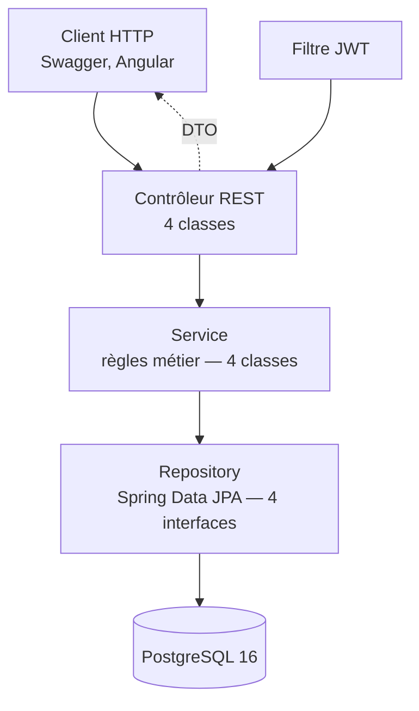
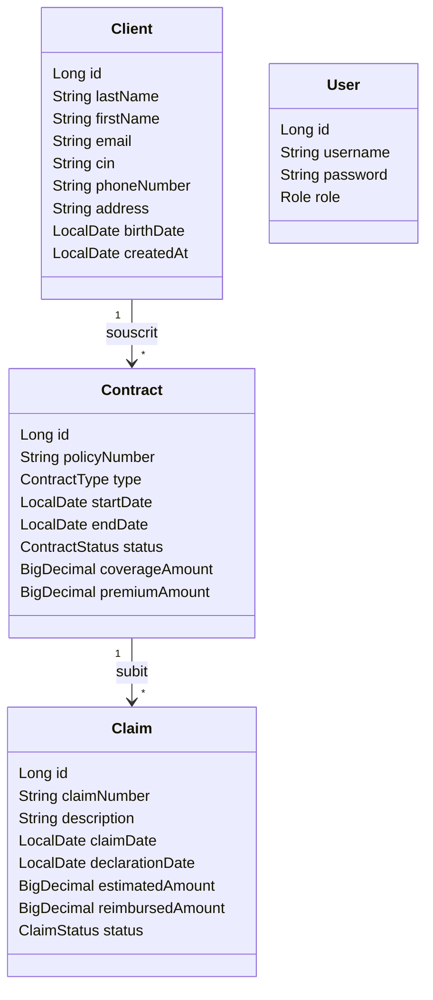
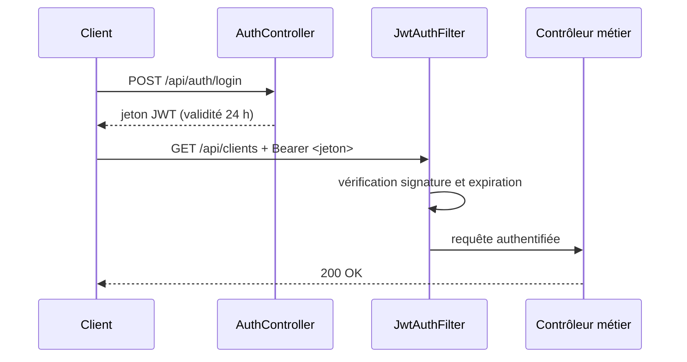
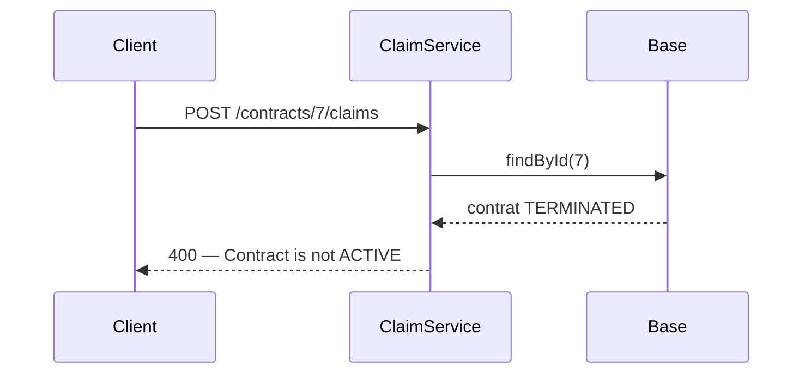

# Conception et réalisation d'une mini-API REST de gestion d'assurance

---

## Page de garde

*[Reprendre le modèle officiel téléchargeable depuis le compte ISIMG — logos Université de Gabès et ISIMG en en-tête]*

**République Tunisienne**
**Ministère de l'Enseignement Supérieur et de la Recherche Scientifique**
**Université de Gabès — Institut Supérieur d'Informatique et de Multimédia de Gabès**

**RAPPORT DE STAGE D'INITIATION**

Première année du cycle d'ingénieur — Génie Logiciel

**Conception et réalisation d'une mini-API REST de gestion d'assurance**

**Réalisé par :** Taher Yahia

**Organisme d'accueil :** Vermeg — Les Berges du Lac, 1053 Tunis

**Encadrante professionnelle :** Mme Faten Kardous, *Lead Developer*, département Insurance Market Operations

**Période :** du 1er au 31 juillet 2026

**Année universitaire 2025 – 2026**

*taher.yahia@isimg.tn — 58 780 980*

---

## Remerciements

Je remercie Mme Faten Kardous, *Lead Developer* au département Insurance Market Operations de Vermeg, pour son encadrement, la clarté des objectifs qu'elle m'a fixés et la précision de ses retours à chaque point d'étape.

Je remercie les collaborateurs de Vermeg que j'ai côtoyés durant ce mois pour leur accueil, ainsi que le corps enseignant de l'ISIMG : les enseignements de programmation orientée objet, de bases de données et d'algorithmique de première année constituent la base directe des travaux présentés dans ce document.

---

## Sommaire

*[Insérer ici une table des matières automatique — Références > Table des matières > Table automatique 1]*

## Liste des figures

*[Insérer ici une table des illustrations — étiquette « Figure »]*

- Figure 1 — Architecture applicative en couches
- Figure 2 — Modèle de domaine
- Figure 3 — Séquence d'authentification par jeton JWT
- Figure 4 — Séquence de déclaration d'un sinistre

## Liste des tableaux

*[Insérer ici une table des illustrations — étiquette « Tableau »]*

- Tableau 1 — Chronologie du développement
- Tableau 2 — Besoins fonctionnels
- Tableau 3 — Périmètre retenu et hors-périmètre
- Tableau 4 — Règles métier implémentées
- Tableau 5 — Difficultés rencontrées et solutions
- Tableau 6 — Compétences acquises et modules associés

---

## Introduction

Le cycle d'ingénieur en Génie Logiciel de l'Institut Supérieur d'Informatique et de Multimédia de Gabès prévoit, dès la première année, un stage d'initiation d'une durée minimale de quatre semaines. Ce stage a pour objet la découverte de l'organisation réelle d'une entreprise du secteur, la mise en pratique des acquis de la formation et la production d'un document professionnel rendant compte du travail effectué.

J'ai effectué ce stage du 1er au 31 juillet 2026 chez Vermeg, éditeur de solutions logicielles pour les services financiers et l'assurance, sous l'encadrement de Mme Faten Kardous, *Lead Developer* au département Insurance Market Operations.

La gestion d'un portefeuille d'assurance repose sur trois objets liés par une chaîne de dépendances stricte : un **client** souscrit un ou plusieurs **contrats**, et un **sinistre** ne peut être déclaré que sur un contrat en cours de validité. Une application qui se contenterait d'enregistrer ces données sans faire respecter ces dépendances produirait des enregistrements dépourvus de sens juridique — un sinistre rattaché à un contrat résilié, par exemple, ou survenu hors de la période de couverture. La question posée était donc la suivante : **comment concevoir un service REST qui expose ces trois objets tout en garantissant, côté serveur, que les règles du métier assurantiel ne peuvent être contournées, quel que soit le client appelant ?**

Cinq objectifs opérationnels ont été fixés :

1. modéliser le domaine client – contrat – sinistre et le persister dans une base relationnelle ;
2. exposer une API REST couvrant les opérations attendues sur ces trois objets ;
3. centraliser les règles métier dans une couche de service, hors des contrôleurs ;
4. protéger les accès par une authentification à jeton, sans état serveur ;
5. publier une documentation d'interface exploitable sans lecture du code source.

Ce rapport rend compte du travail en cinq chapitres. Le chapitre 1 présente l'entreprise, le cadre et la méthode de travail. Le chapitre 2 formalise le besoin et la conception retenue. Le chapitre 3 détaille la réalisation technique. Le chapitre 4 expose la vérification, les résultats obtenus et le regard critique porté sur le livrable. Le chapitre 5 dresse le bilan des apports au regard de la formation.

---

## Chapitre 1 — Cadre du stage

### 1.1. Présentation de Vermeg

Vermeg est un éditeur de solutions logicielles spécialisé dans les services financiers, dont l'offre couvre la banque, les marchés de capitaux, la gestion d'actifs et l'assurance [1]. Fondée en 1993 en Tunisie sous le nom de BFI, dont elle a été détachée en 2002, l'entreprise a aujourd'hui son siège à Amsterdam et dispose d'implantations sur plusieurs continents, dont la Tunisie [2]. Son activité consiste à fournir aux institutions financières des progiciels métier et des développements sur mesure : gestion de portefeuilles, reporting réglementaire, gestion du collatéral et gestion de polices d'assurance [1].

Cette activité explique la nature du sujet confié. Un éditeur de logiciels d'assurance manipule quotidiennement les notions de police, de prime, de couverture et de sinistre ; le stage a consisté à en reproduire un noyau minimal, à l'échelle d'un exercice d'initiation.

### 1.2. Organisation et méthode de travail

Le stage s'est déroulé du 1er au 31 juillet 2026. L'organisation a reposé sur un rythme itératif : un objectif fonctionnel par séance, une réalisation autonome, puis un point de validation avec l'encadrante. La validation portait sur le comportement fonctionnel de l'API — appels de démonstration et réponses obtenues — et non sur une relecture ligne à ligne du code source.

Le travail a produit **trente-deux commits**, dont vingt-neuf de développement répartis sur huit journées effectives, les trois derniers relevant de la rédaction documentaire. Le dépôt totalise environ 12 600 lignes ajoutées et 760 supprimées sur la phase de développement. Le tableau 1 retrace cette progression.

*Tableau 1 — Chronologie du développement*

| Date | Commits | Travaux réalisés |
|---|---|---|
| 5 juillet | 2 | Initialisation du projet via Spring Initializr ; configuration de la source de données PostgreSQL, désactivation d'`open-in-view` |
| 6 juillet | 4 | Entité `Client`, *repository* et schéma ; CRUD avec DTO, service et contrôleur REST ; entité `Contract` avec relation client et validation des dates |
| 7 juillet | 4 | Entité `Claim` et ses règles métier ; gestionnaire global d'exceptions ; diagramme de classes ; intégration d'OpenAPI ; correction d'une `NullPointerException` dans le gestionnaire d'erreurs |
| 8 juillet | 4 | Authentification JWT et configuration Spring Security ; rédaction du `README` ; configuration OpenAPI pour le jeton ; traduction de l'ensemble du code en anglais |
| 13 juillet | 5 | Modification d'un client ; enrichissement des domaines `Client` et `Contract` (téléphone, adresse, numéro de police, type, prime) ; enrichissement du domaine `Claim` (numéro, montants, statuts) |
| 15 juillet | 4 | Suppression d'un client avec contrôle métier ; liste des sinistres par contrat ; mise à jour d'un contrat ; premier test unitaire sur la règle du contrat résilié |
| 21 juillet | 1 | Création des fichiers Docker ; début du client Angular (modèle et service d'authentification) |
| 22 juillet | 5 | Renseignement des fichiers Docker ; intercepteur JWT et garde de route ; liste des clients ; navigation ; formulaire de création ; feuilles de style |

Deux observations ressortent de cette chronologie. D'abord, le travail s'est concentré sur des journées espacées plutôt que sur un flux continu, ce qui a imposé de reprendre le contexte du développement précédent à chaque reprise. Ensuite, le backend a été entièrement traité entre le 5 et le 15 juillet ; les 21 et 22 juillet ont été consacrés à la conteneurisation et au client Angular, ce dernier relevant d'une initiative personnelle.

Le suivi de version a été assuré par Git, avec des messages conformes à la convention *Conventional Commits* [3] : les trente-deux messages se répartissent en dix-neuf `feat`, six `docs`, deux `refactor`, deux `chore`, un `test`, un `style` et un `fix`.

Je relève toutefois une limite dans cette pratique. L'ensemble du travail a été committé sur une seule branche, y compris le client Angular qui ne relevait pas du périmètre demandé ; une branche de fonctionnalité dédiée aurait mieux isolé cette exploration du backend déjà validé. Par ailleurs, le commit du 21 juillet mêle deux sujets sans rapport — la création des fichiers Docker et le début du service d'authentification Angular — alors qu'un commit devrait porter un changement cohérent unique. C'est le point de méthode que je retiens le plus nettement de ce stage.

---

## Chapitre 2 — Analyse du besoin et conception

### 2.1. Besoins fonctionnels

Le besoin exprimé porte sur trois objets métier et sur les contraintes qui les relient. Le tableau 2 en dresse la liste.

*Tableau 2 — Besoins fonctionnels*

| Réf. | Besoin | Objet concerné |
|---|---|---|
| BF1 | Créer, consulter, modifier et supprimer un client | Client |
| BF2 | Identifier un client de façon unique par son numéro de CIN | Client |
| BF3 | Souscrire un contrat rattaché à un client existant | Contrat |
| BF4 | Consulter et mettre à jour un contrat, notamment son statut | Contrat |
| BF5 | Déclarer un sinistre sur un contrat | Sinistre |
| BF6 | Consulter les sinistres rattachés à un contrat | Sinistre |
| BF7 | Créer un compte utilisateur et obtenir un jeton d'accès | Utilisateur |

### 2.2. Besoins non fonctionnels

Quatre exigences transverses ont été retenues : **sécurité** — aucune opération métier accessible sans authentification ; **intégrité** — toute règle métier appliquée côté serveur, jamais déléguée au client ; **documentation** — interface exploitable sans lecture du code ; **reproductibilité** — environnement d'exécution démarrable sur un poste tiers sans installation manuelle de base de données.

### 2.3. Périmètre

Le tableau 3 délimite ce qui a été traité et ce qui a été explicitement écarté.

*Tableau 3 — Périmètre retenu et hors-périmètre*

| Retenu | Hors-périmètre |
|---|---|
| API REST backend, base PostgreSQL, sécurité JWT, documentation OpenAPI | Interface graphique de production |
| Règles métier client – contrat – sinistre | Calcul actuariel des primes |
| Conteneurisation pour le développement local | Déploiement en production, supervision |
| Un test unitaire sur la règle centrale | Campagne de tests systématique |

Un client web Angular a été amorcé en fin de stage. **Il ne fait pas partie du besoin exprimé** : il s'agit d'une initiative personnelle, partielle et assumée comme telle, destinée à vérifier que l'API était consommable par un client externe. Ce point est repris en 3.6 et en 4.4.

### 2.4. Architecture applicative

L'application suit une architecture en couches, chaque couche ne dialoguant qu'avec la couche immédiatement inférieure.

*[Figure 1 — exporter le diagramme suivant en PNG depuis mermaid.live avant insertion]*



*Figure 1 — Architecture applicative en couches. Le filtre JWT s'interpose avant tout accès aux contrôleurs.*

Ce découpage répond directement à l'exigence d'intégrité. En plaçant les règles métier dans la couche service et non dans les contrôleurs, on garantit qu'elles s'appliquent quel que soit le point d'entrée : un futur contrôleur, une tâche planifiée ou un appel interne les traverseront nécessairement.

Le dépôt compte 45 classes Java pour environ 1 500 lignes, réparties en contrôleurs (4), services (4), entités et énumérations (8), DTO (11), *mappers* (3), *repositories* (4), classes de sécurité (4), configuration (3) et exceptions (3).

### 2.5. Modèle de domaine

*[Figure 2 — exporter en PNG avant insertion]*



*Figure 2 — Modèle de domaine. La chaîne client → contrat → sinistre porte l'essentiel des contraintes métier.*

Quatre énumérations complètent le modèle : `ContractType` (AUTO, HOME, HEALTH, LIFE), `ContractStatus` (ACTIVE, EXPIRED, TERMINATED), `ClaimStatus` (SUBMITTED, PROCESSING, ACCEPTED, REJECTED) et `Role` (ADMIN, AGENT).

Deux choix de modélisation méritent justification. Les montants — couverture, prime, estimation, remboursement — sont typés `BigDecimal` et non `double` : la représentation binaire des flottants introduit des erreurs d'arrondi inacceptables sur des valeurs monétaires. Les énumérations sont persistées via `@Enumerated(EnumType.STRING)` plutôt que par leur indice : le stockage de l'indice rendrait la base illisible et, surtout, corromprait les données existantes dès qu'une valeur serait insérée au milieu de l'énumération.

### 2.6. Conception de la sécurité

L'authentification repose sur un jeton JWT, sans session serveur. Ce choix découle de la nature du service : une API REST consommée par des clients hétérogènes n'a pas de raison de maintenir un état de session, et la politique `STATELESS` élimine par construction toute une classe de problèmes liés à la synchronisation de sessions.

*[Figure 3 — exporter en PNG avant insertion]*



*Figure 3 — Séquence d'authentification par jeton JWT.*

Les mots de passe sont hachés avec BCrypt avant persistance. La protection CSRF est désactivée : elle vise les attaques exploitant les cookies transmis automatiquement par le navigateur, alors que le jeton est ici porté explicitement dans l'en-tête `Authorization`. Cette désactivation est donc cohérente avec le mode d'authentification retenu, et non une facilité [4].

---

## Chapitre 3 — Réalisation technique

### 3.1. Choix techniques

| Élément | Retenu | Justification |
|---|---|---|
| Langage | Java 17 | Version LTS, socle des enseignements de POO |
| Framework | Spring Boot 3.5.16 | Standard de l'écosystème Java d'entreprise [5] |
| Persistance | Spring Data JPA / Hibernate | Abstraction de l'accès aux données [6] |
| Base | PostgreSQL 16 | SGBD relationnel libre, transactionnel [7] |
| Sécurité | Spring Security + JJWT 0.12.6 | Chaîne de filtres standard [4] |
| Documentation | Springdoc OpenAPI 2.7.0 | Génération conforme à OpenAPI 3 [8] |
| Conteneurisation | Docker Compose | Environnement reproductible [9] |

### 3.2. Persistance et exposition des données

Les entités sont annotées `@Entity` et le schéma est généré par Hibernate. La relation `Contract → Client` est déclarée `@ManyToOne(fetch = FetchType.LAZY)` : le chargement immédiat ramènerait le client à chaque lecture de contrat, y compris lorsque cette information n'est pas utilisée. Le paramètre `open-in-view` est désactivé, ce qui force la fermeture de la session de persistance à la sortie de la couche service et interdit tout chargement différé involontaire depuis la couche web.

Les entités ne sont jamais exposées directement. Onze DTO — objets de transfert dédiés — assurent la séparation entre le modèle interne et le contrat d'interface. Ce choix a trois effets : il évite les erreurs de sérialisation sur les relations différées, il empêche l'exposition involontaire de champs sensibles comme le mot de passe haché, et il permet de faire évoluer le modèle interne sans rompre l'interface publique.

La validation des entrées s'appuie sur les annotations de Jakarta Bean Validation portées par les DTO : trente-quatre contraintes au total, dont seize `@NotBlank`, onze `@NotNull`, cinq `@Positive` et deux `@Email`. Ces contrôles sont syntaxiques et se distinguent des règles métier, traitées en 3.4.

### 3.3. Sécurité

La chaîne de filtres est déclarée dans une classe de configuration unique.

```java
http
    .cors(Customizer.withDefaults())
    .csrf(csrf -> csrf.disable())
    .authorizeHttpRequests(auth -> auth
        .requestMatchers("/api/auth/**").permitAll()
        .requestMatchers("/swagger-ui/**", "/v3/api-docs/**").permitAll()
        .anyRequest().authenticated())
    .sessionManagement(s -> s.sessionCreationPolicy(SessionCreationPolicy.STATELESS))
    .authenticationProvider(authenticationProvider())
    .addFilterBefore(jwtAuthFilter, UsernamePasswordAuthenticationFilter.class);
```

*Extrait 1 — Chaîne de filtres de sécurité. Seuls l'authentification et la documentation sont ouverts ; tout le reste exige un jeton valide.*

Le filtre `JwtAuthFilter` est positionné avant le filtre d'authentification par identifiants : il extrait le jeton de l'en-tête `Authorization`, en vérifie la signature et l'expiration, puis alimente le contexte de sécurité. Le jeton a une validité de vingt-quatre heures. Une politique CORS autorise l'origine `http://localhost:4200`, nécessaire au client Angular décrit en 3.6.

### 3.4. Fonctionnalités et règles métier

Treize points d'accès sont exposés (annexe A) : deux pour l'authentification, cinq pour les clients, quatre pour les contrats et deux pour les sinistres. La valeur du service ne réside cependant pas dans ces opérations d'accès aux données, mais dans les dix règles que le serveur fait respecter, recensées dans le tableau 4.

*Tableau 4 — Règles métier implémentées*

| Réf. | Règle | Emplacement | Réaction |
|---|---|---|---|
| RM1 | La date de fin d'un contrat ne peut précéder sa date de début | `ContractService` | Exception métier |
| RM2 | Un contrat créé est nécessairement au statut `ACTIVE` | `ContractService` | Valeur imposée |
| RM3 | Le numéro de police est généré par le serveur | `ContractService` | Valeur imposée |
| RM4 | Un statut de contrat invalide est rejeté à la mise à jour | `ContractService` | Exception métier |
| RM5 | Aucun sinistre ne peut être déclaré sur un contrat non `ACTIVE` | `ClaimService` | Exception métier |
| RM6 | La date de survenance doit tomber dans la période de couverture | `ClaimService` | Exception métier |
| RM7 | Un sinistre créé est `SUBMITTED`, remboursement initialisé à zéro | `ClaimService` | Valeurs imposées |
| RM8 | La date de création d'un client est fixée par le serveur | `ClientService` | Valeur imposée |
| RM9 | Un client rattaché à un contrat ne peut être supprimé | `ClientService` | Exception métier |
| RM10 | Un nom d'utilisateur ne peut être utilisé deux fois | `UserService` | Exception |

Les règles RM5 et RM6 sont les plus significatives sur le plan métier. Accepter une déclaration de sinistre sur un contrat résilié, ou survenu hors de la période de couverture, produirait un enregistrement sans portée juridique : l'assureur n'a aucune obligation d'indemnisation dans ces deux cas.

```java
@Transactional
public ClaimResponseDto createClaim(Long contractId, ClaimCreateDto dto) {
    Contract contract = contractRepository.findById(contractId)
            .orElseThrow(() -> new NotFoundException("Contract not found with ID: " + contractId));

    if (contract.getStatus() != ContractStatus.ACTIVE) {
        throw new BusinessRuleException("Cannot file a claim: Contract is not ACTIVE");
    }
    if (dto.claimDate().isBefore(contract.getStartDate())
            || dto.claimDate().isAfter(contract.getEndDate())) {
        throw new BusinessRuleException("Claim date must be within the contract coverage period");
    }
    // construction du sinistre : statut SUBMITTED, numéro généré, persistance
}
```

*Extrait 2 — Application des règles RM5 et RM6. La méthode est transactionnelle : en cas d'exception, aucune écriture partielle n'est validée.*

*[Figure 4 — exporter en PNG avant insertion]*



*Figure 4 — Séquence de déclaration d'un sinistre rejetée par la règle RM5.*

Un composant `DataInitializer` alimente la base au démarrage si elle est vide : deux comptes utilisateurs, un client et deux contrats — l'un actif, l'autre résilié, ce dernier permettant de vérifier immédiatement la règle RM5. Il s'agit exclusivement de données de démonstration destinées au développement local.

### 3.5. Documentation et conteneurisation

La documentation OpenAPI est générée automatiquement à partir des annotations et publiée sur `/swagger-ui/index.html` [8]. Le schéma de sécurité y est déclaré, ce qui permet de saisir un jeton dans l'interface et d'exécuter les appels protégés directement depuis le navigateur — l'API est ainsi exploitable sans lecture du code, conformément à l'exigence posée en 2.2.

L'environnement est décrit par un fichier Docker Compose déclarant deux services : la base PostgreSQL 16 et l'API. Le démarrage de l'API est conditionné par un `healthcheck` sur la base — sans cette condition, l'application démarrerait avant que PostgreSQL n'accepte les connexions et échouerait. L'image applicative est construite en deux étapes [9] : une première à base de Maven compile le projet, une seconde ne conserve que l'archive exécutable sur une image JRE, ce qui exclut l'outillage de compilation de l'image finale. Les paramètres de connexion sont injectés par variables d'environnement, conformément au principe de séparation entre code et configuration [10].

### 3.6. Initiative personnelle : client Angular

Un client web Angular 21 a été amorcé les 21 et 22 juillet, en dehors du périmètre demandé. Il comporte 25 fichiers pour environ 520 lignes et couvre quatre écrans : connexion, tableau de bord, liste des clients et formulaire de création. Un intercepteur HTTP ajoute automatiquement le jeton aux requêtes sortantes et une garde de route protège les pages nécessitant une authentification.

Cette exploration a rempli son objectif : elle a démontré que l'API était consommable par un client externe et a mis en évidence le besoin de configuration CORS mentionné en 3.3. Elle reste **partielle** — la gestion des contrats et des sinistres n'y figure pas, et le test unitaire par défaut du gabarit n'a pas été adapté.

---

## Chapitre 4 — Vérification, résultats et regard critique

### 4.1. Vérification

La vérification a reposé principalement sur des essais manuels via l'interface OpenAPI : pour chaque point d'accès, un appel nominal et au moins un appel en violation de règle, avec contrôle du code HTTP et du corps de la réponse. Le jeu de données du `DataInitializer`, qui comporte volontairement un contrat résilié, permet de rejouer la règle RM5 à chaque démarrage.

Un test unitaire automatisé a été écrit : il vérifie, à l'aide de Mockito, que `ClaimService.createClaim` lève bien une `BusinessRuleException` lorsque le contrat visé est au statut `TERMINATED`. Le choix de cette règle n'est pas arbitraire — c'est la contrainte centrale du domaine. **Il s'agit néanmoins du seul test automatisé du projet**, pour treize points d'accès et dix règles métier.

### 4.2. Résultats

Les cinq objectifs fixés en introduction sont atteints sur le périmètre demandé : le domaine est modélisé et persisté, treize points d'accès sont exposés, les dix règles métier sont centralisées dans la couche service, l'accès est protégé par jeton et la documentation est publiée et navigable. L'environnement conteneurisé démarre par une commande unique.

### 4.3. Difficultés rencontrées

Sept difficultés techniques ont jalonné le développement ; le tableau 5 en présente l'analyse et la solution retenue.

*Tableau 5 — Difficultés rencontrées et solutions*

| Difficulté | Analyse | Solution retenue |
|---|---|---|
| `NullPointerException` dans le gestionnaire d'exceptions | `Map.of` refuse les valeurs nulles ; certaines exceptions ont un message nul | Passage à `HashMap` avec message par défaut |
| Erreurs de sérialisation sur les relations différées | Jackson tentait de sérialiser un proxy Hibernate non initialisé | Introduction systématique de DTO |
| Ordre des filtres Spring Security | Le filtre JWT s'exécutait après le filtre d'authentification | `addFilterBefore` explicite |
| Requêtes Angular bloquées par le navigateur | Origines distinctes entre `:4200` et `:8080` | Configuration CORS restreinte à l'origine du client |
| Imprécision sur les montants | Arrondis binaires du type `double` | Passage à `BigDecimal` |
| Reprise de contexte entre journées espacées | Huit journées non consécutives | Messages de commit descriptifs servant de journal |
| Codebase initialement rédigée en français | Incohérence avec les conventions professionnelles | Traduction intégrale en anglais le 8 juillet |

La première difficulté mérite un développement. Le gestionnaire global construisait sa réponse d'erreur avec `Map.of("error", ex.getMessage())`. Or `Map.of` lève une `NullPointerException` si une valeur est nulle, ce qui est le cas de certaines exceptions internes. Le symptôme observé était trompeur : l'API renvoyait une erreur 500 opaque là où une erreur explicite était attendue — le mécanisme censé rendre les erreurs lisibles était lui-même la source de l'erreur. La correction fut brève, mais l'enseignement ne l'est pas : **le code de gestion d'erreur doit être écrit avec la même rigueur que le code nominal, parce qu'il s'exécute précisément quand tout le reste a déjà échoué.**

### 4.4. Regard critique

Le livrable présente sept limites que j'identifie clairement.

**1. Les contrôles d'autorisation par rôle sont inopérants.** Trois annotations `@PreAuthorize` figurent sur les contrôleurs, mais l'annotation `@EnableMethodSecurity` est absente de la configuration : la sécurité de méthode n'est pas activée, et ces annotations **ne sont donc jamais évaluées**. Concrètement, tout utilisateur authentifié — y compris avec le rôle `AGENT` — peut appeler les opérations censées être réservées au rôle `ADMIN`. C'est le défaut le plus sérieux du projet. Il est d'autant plus instructif que le code *paraît* sécurisé à la lecture : l'intention est écrite, mais elle n'est pas exécutée. Une annotation manquante ne produit ni erreur de compilation ni avertissement à l'exécution ; seul un test d'autorisation l'aurait révélée — test qui n'a pas été écrit.

**2. Le secret de signature JWT figure en clair dans le dépôt.** Les paramètres de la base de données sont correctement externalisés par variables d'environnement, mais `jwt.secret` est écrit en dur dans `application.yaml` et versionné. Quiconque accède au dépôt peut forger un jeton valide. La correction est triviale — `${JWT_SECRET}` — et l'incohérence est révélatrice : j'ai appliqué le bon principe à la configuration que Docker m'imposait d'externaliser, sans l'étendre par moi-même au reste.

**3. La gestion des erreurs est trop grossière.** Un unique gestionnaire intercepte toutes les `RuntimeException` et renvoie systématiquement un code 400. Une ressource inexistante devrait produire un 404 et une erreur inattendue un 500 ; ici, les trois cas sont indiscernables pour le client. Le format de réponse s'écarte par ailleurs de la représentation normalisée des erreurs HTTP [11].

**4. La couverture de test est très faible.** Un test pour treize points d'accès et dix règles métier. Aucun test d'intégration ne valide la chaîne complète, aucune mesure de couverture n'est produite et aucune intégration continue n'exécute la suite de tests.

**5. La montée en charge n'est pas traitée.** Les points d'accès de liste renvoient l'intégralité des enregistrements sans pagination : le temps de réponse croît linéairement avec le volume de données.

**6. Le schéma est géré par `ddl-auto: update`.** Acceptable en développement, cette approche est inadaptée dès lors que des données doivent être préservées : elle ne gère ni les suppressions de colonnes ni les migrations de données, et n'offre aucune traçabilité des évolutions. Un outil de migration versionnée serait nécessaire.

**7. Le jeu de données de démonstration n'est pas isolé.** Le `DataInitializer` s'exécute quel que soit l'environnement ; il devrait être conditionné à un profil Spring dédié, faute de quoi un compte `admin/admin123` serait créé partout où l'application démarre.

Ces sept limites ont un dénominateur commun : elles concernent toutes ce qui sépare un exercice fonctionnel d'un service exploitable. Le code produit *fonctionne* dans les conditions où il a été éprouvé ; il n'est pas armé pour celles où il ne l'a pas été. C'est précisément la distinction que ce stage m'a permis de percevoir.

---

## Chapitre 5 — Apports du stage

### 5.1. Compétences acquises

Le tableau 6 associe chaque compétence acquise au niveau réellement atteint et, lorsqu'il existe, au module de la formation qui en constituait la base.

*Tableau 6 — Compétences acquises et modules associés*

| Compétence | Niveau atteint | Module ISIMG associé |
|---|---|---|
| Modélisation objet et relations entre entités | Consolidé | Programmation orientée objet |
| Conception de schéma relationnel, transactions | Consolidé | Bases de données |
| Architecture en couches et injection de dépendances | Nouveau | — |
| Conception d'API REST et sémantique HTTP | Nouveau | — |
| Authentification par jeton et hachage | Initié | — |
| Test unitaire avec doublure | Initié | Algorithmique et structures de données |
| Conteneurisation et configuration externalisée | Initié | — |
| Suivi de version structuré | Consolidé | — |

Trois acquis me paraissent structurants au-delà de la liste.

Le premier est la **distinction entre validation syntaxique et règle métier**. Une contrainte `@NotNull` vérifie qu'un champ est renseigné ; elle ne dit rien de la légitimité de l'opération. Vérifier qu'un contrat est actif avant d'accepter un sinistre relève d'une autre nature de contrôle, qui appartient au domaine et doit vivre dans la couche service. Cette séparation ne m'était pas évidente au début du stage.

Le deuxième est la **notion de contrat d'interface**. Exposer une entité de persistance revient à publier sa structure interne et à s'interdire de la modifier ensuite. Le DTO n'est pas une couche de recopie inutile : c'est ce qui rend le modèle interne libre d'évoluer.

Le troisième est l'**écart entre code écrit et code exécuté**. Le défaut des annotations `@PreAuthorize` en est l'illustration la plus nette : une intention correctement formulée mais jamais activée. Cet écart ne se comble pas par la relecture, mais par la vérification automatisée — c'est le principal manque de ce projet, et je l'ai identifié en le subissant.

### 5.2. Compétences transversales

Le rythme de journées espacées a imposé une discipline de traçabilité : sans messages de commit descriptifs, la reprise du contexte après plusieurs jours d'interruption aurait été coûteuse. Les points de validation avec l'encadrante m'ont par ailleurs conduit à formuler des choix techniques en termes de conséquences fonctionnelles plutôt que d'implémentation — un exercice de reformulation que je n'avais jamais pratiqué en contexte académique.

### 5.3. Perspectives

Par ordre d'utilité décroissante, quatre actions me semblent prioritaires : activer la sécurité de méthode et la couvrir par des tests d'autorisation ; externaliser le secret JWT ; différencier les codes d'erreur HTTP ; construire une suite de tests d'intégration exécutée par une intégration continue. Les trois premières relèvent de moins d'une heure de travail cumulée ; la quatrième est le véritable chantier, et c'est celle dont l'absence explique en grande partie les trois autres.

---

## Conclusion

Ce stage d'initiation d'un mois chez Vermeg avait pour objet la réalisation d'une mini-API REST de gestion d'assurance. L'objectif est atteint sur le périmètre demandé : le service expose la gestion des clients, des contrats et des sinistres, s'appuie sur une base PostgreSQL, protège ses accès par un jeton JWT, valide ses entrées, centralise dix règles métier dans la couche service et publie une documentation OpenAPI interactive. La conteneurisation rend l'environnement reproductible sur un poste tiers, et un client Angular partiel a confirmé que l'API était consommable de l'extérieur.

L'apport principal de ce stage n'est pourtant pas la maîtrise d'une pile technique. C'est la mesure de l'écart entre un programme qui fonctionne et un service dont on peut garantir le comportement. Le défaut des annotations d'autorisation inopérantes résume cet écart à lui seul : un code peut être lisible, structuré, conforme à l'intention de son auteur, et néanmoins ne pas faire ce qu'il annonce. Seule la vérification automatisée établit la différence.

C'est la limite que je retiens et l'orientation que je donne à la suite de ma formation.

---

## Bibliographie et webographie

[1] VERMEG, « À propos — éditeur de solutions logicielles pour les services financiers ». [En ligne]. Disponible : https://www.vermeg.com — consulté le 27 juillet 2026.

[2] Wikipedia, « Vermeg ». [En ligne]. Disponible : https://en.wikipedia.org/wiki/Vermeg — consulté le 27 juillet 2026.

[3] Conventional Commits, « Conventional Commits 1.0.0 ». [En ligne]. Disponible : https://www.conventionalcommits.org/fr/v1.0.0/ — consulté le 27 juillet 2026.

[4] VMware Tanzu, « Spring Security Reference — Architecture ». [En ligne]. Disponible : https://docs.spring.io/spring-security/reference/servlet/architecture.html — consulté le 27 juillet 2026.

[5] VMware Tanzu, « Spring Boot Reference Documentation », version 3.5. [En ligne]. Disponible : https://docs.spring.io/spring-boot/documentation.html — consulté le 27 juillet 2026.

[6] VMware Tanzu, « Spring Data JPA Reference Documentation ». [En ligne]. Disponible : https://docs.spring.io/spring-data/jpa/reference/ — consulté le 27 juillet 2026.

[7] The PostgreSQL Global Development Group, « PostgreSQL 16 Documentation ». [En ligne]. Disponible : https://www.postgresql.org/docs/16/ — consulté le 27 juillet 2026.

[8] OpenAPI Initiative, « OpenAPI Specification v3.1 ». [En ligne]. Disponible : https://spec.openapis.org/oas/v3.1.0 — consulté le 27 juillet 2026.

[9] Docker Inc., « Multi-stage builds », Docker Documentation. [En ligne]. Disponible : https://docs.docker.com/build/building/multi-stage/ — consulté le 27 juillet 2026.

[10] A. WIGGINS, « The Twelve-Factor App — III. Config ». [En ligne]. Disponible : https://12factor.net/fr/config — consulté le 27 juillet 2026.

[11] M. NOTTINGHAM, E. WILDE et S. DALAL, « RFC 9457 : Problem Details for HTTP APIs », IETF, juillet 2023. [En ligne]. Disponible : https://www.rfc-editor.org/rfc/rfc9457 — consulté le 27 juillet 2026.

---

## Annexe A — Points d'accès de l'API

| Méthode | Chemin | Description | Accès |
|---|---|---|---|
| POST | `/api/auth/register` | Création d'un compte | Public |
| POST | `/api/auth/login` | Obtention d'un jeton JWT | Public |
| POST | `/api/clients` | Création d'un client | Authentifié |
| GET | `/api/clients` | Liste des clients | Authentifié |
| GET | `/api/clients/{id}` | Consultation d'un client | Authentifié |
| PUT | `/api/clients/{id}` | Modification d'un client | Authentifié |
| DELETE | `/api/clients/{id}` | Suppression (règle RM9) | Authentifié |
| POST | `/api/contracts` | Souscription d'un contrat | Authentifié |
| GET | `/api/contracts` | Liste des contrats | Authentifié |
| GET | `/api/contracts/{id}` | Consultation d'un contrat | Authentifié |
| PUT | `/api/contracts/{id}` | Mise à jour d'un contrat | Authentifié |
| POST | `/api/contracts/{id}/claims` | Déclaration d'un sinistre | Authentifié |
| GET | `/api/contracts/{id}/claims` | Sinistres d'un contrat | Authentifié |

> Les annotations `@PreAuthorize` présentes sur trois de ces opérations sont inopérantes (section 4.4, limite 1). La colonne « Accès » reflète le comportement réel et non l'intention exprimée dans le code.

## Annexe B — Démarrage

**Avec Docker Compose** — méthode recommandée, aucune installation préalable de PostgreSQL :

```bash
docker compose up --build
```

**En local** — nécessite une base `assurance_db` accessible :

```bash
./mvnw spring-boot:run
```

Documentation interactive : `http://localhost:8080/swagger-ui/index.html`
Compte de démonstration : `admin / admin123`

Séquence de vérification : appeler `POST /api/auth/login`, copier le jeton, l'enregistrer via le bouton *Authorize*, puis appeler `POST /api/contracts/{id}/claims` sur le contrat résilié créé par le `DataInitializer` — la réponse attendue est un rejet au titre de la règle RM5.

## Annexe C — Glossaire

| Terme | Définition |
|---|---|
| **Police** | Document contractuel matérialisant l'engagement entre l'assureur et l'assuré |
| **Prime** | Somme versée périodiquement par l'assuré en contrepartie de la couverture |
| **Couverture** | Montant maximal garanti par l'assureur au titre du contrat |
| **Sinistre** | Événement dommageable déclaré par l'assuré et susceptible d'indemnisation |
| **DTO** | Objet de transfert de données, distinct de l'entité de persistance |
| **JWT** | Jeton signé transportant l'identité de l'appelant sans état serveur |
| **CIN** | Carte d'identité nationale, identifiant unique du client |
