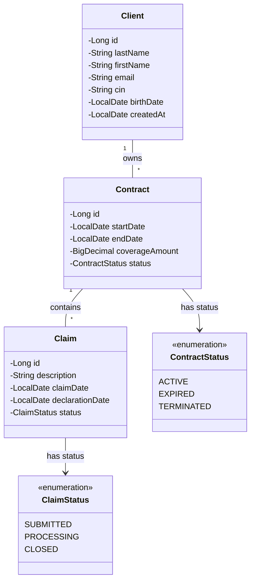

# Architecture Mini-API Assurance

## Domain Model Class Diagram



## Translation Notes

- `Contrat` → `Contract`
- `Sinistre` → `Claim`
- `StatutContrat` → `ContractStatus` : ACTIF/EXPIRE/RESILIE → ACTIVE/EXPIRED/TERMINATED
- `StatutSinistre` → `ClaimStatus` : DECLARE/EN_COURS/CLOTURE → SUBMITTED/PROCESSING/CLOSED
- Field mapping preserved 1:1, JPA constraints preserved (`@Column(unique=true, nullable=false)`, `@Column(nullable=false)`, `@GeneratedValue`).
```
